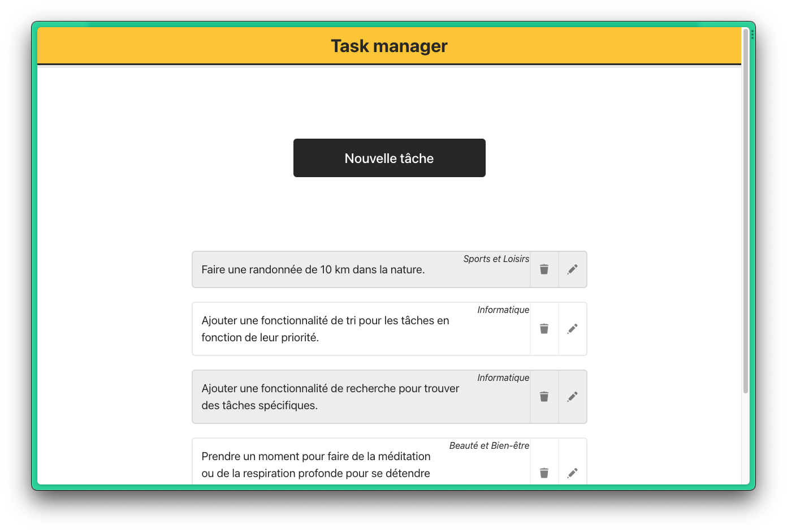

# Task-Manager



**Task-Manager** est une application Web permettant de gérer les tâches en utilisant JavaScript pour la partie frontend et Laravel pour gérer la partie backend.

## Fonctionnalités

- Ajouter une tâche
- Modifier une tâche
- Affecter une tâche à une catégorie
- Supprimer une tâche

## Prérequis

- PHP >= 7.3
- Composer

## Installation et configuration

1. Cloner ce dépôt sur votre ordinateur.
2. Ouvrez un terminal et accédez au répertoire racine de l'application.
3. Exécutez en ligne de commande :

```
cd backend/
composer install
```

Cela va installer les dépendances PHP.

4. Dans le dossier `backend`, copiez le fichier `.env.example` en `.env` et configurez les paramètres de base de données.

   **Remplicez les champs :**

   Le nom de la base de données :

   ```
   DB_DATABASE= (donnez le nom souhaité pour la base de données)
   ```

   Le nom de l'utilisateur avec lequel se connecter :

   ```
   DB_USERNAME=
   ```

   Le mot de passe de l'utilisateur :

   ```
   DB_PASSWORD=
   ```

Note: Assurez-vous que votre base de données est en cours d'exécution sur le port `3306`. Si ce n'est pas le cas, veuillez modifier la valeur de `DB_PORT`.

5. Dans le terminal exécutez :

```bash
php artisan key:generate
php artisan migrate
```

Répondez par `yes` pour permettre à **Laravel** de créer une base de données portant le nom que vous avez spécifié lors de la configuration.

Cela va créer les base de données requisent au bon fonctionnement de l'application

## Utilisation

Dans le même terminal, exécutez:

```bash
php artisan serve --port=8001
```

Cela lancera le serveur pour gerer l'API.
Le serveur se lancera sur le port 8001 pour eviter les erreurs si votre localhost est lancé sur le port 80

Dans un nouveau terminal, placez vous à la racine du projet, et éxecutez la commande :

```bash
php -S localhost:8080 -t frontend/
```

Accédez à l'URL affichée dans le terminal pour accéder à l'application.

Vous pouvez maintenant utiliser **TaskManager**

### À venir

Ajout d'une fonctionnalité qui permettera aux utilisateurs d'ajouter des tags aux tâches.
